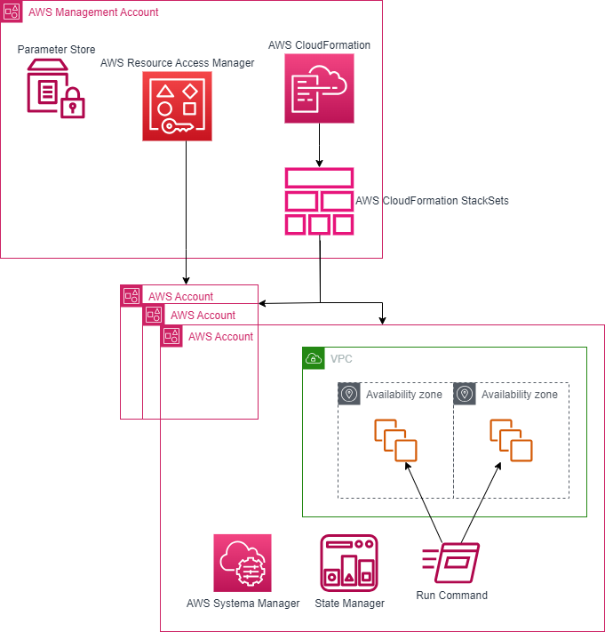

# Automate Systems Manager patching reports via email and slack notifications in an AWS Organization

This repo hosts CloudFormation templates related to the AWS Cloud Operations blog post:

[**Manage third party application installation, versioning and updates in Windows Server nodes using AWS System Manager and Chocolatey**](https://aws.amazon.com/blogs/mt/manage-third-party-application-installation-versioning-and-updates-in-windows-server-nodes-using-aws-system-manager-and-chocolatey/)

For details on how to use the corresponding CloudFormation templates, refer to the blog post.

CloudFormation Templates:

* [manageThirdPartyApplications-CFN.yml](/Templates/CloudFormation/manageThirdPartyApplications-CFN.yml)

## Security

See [CONTRIBUTING](CONTRIBUTING.md#security-issue-notifications) for more information.

## License

This library is licensed under the MIT-0 License. See the LICENSE file.
